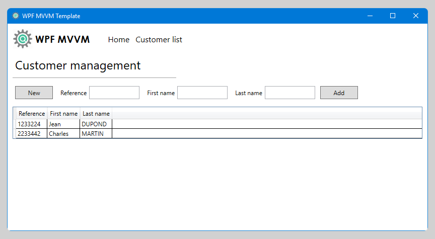

# WPF MVVM Template

## 🎯 Goal

Provide a template to start a new WPF project using the MVVM architecture pattern.

## 💼 Content

- Navbar to navigate between views
- View displaying static content
- View to manage a customer list (CRUD)
- MVVM utilities

## 🔎 Structure

### WpfMvvm.Business

Contains all the business rules and the business objects.

### WpfMvvm.Data

Contains the logic to manage the data.  
There are 2 ways to store data:

- In memory: the app is storing data temporary ; everything is lost when the app is closed.
- SQLite database: the data persistent ; it is stored in customer.db.

You can choose which method to use in the file `WpfMvvm.Front\ContainerHelper.cs`.  
Feel free to add any other method by implementing `ICustomerRepository`.

### WpfMvvm.Front

Contains the UI.

## ❓ Q&A

### Why did you use DotNet Framework instead of DotNet Core?

I did this template with specific requirements for another projet.  
The aim was to use this one as a proof of concept to see if it could work in our environment.
